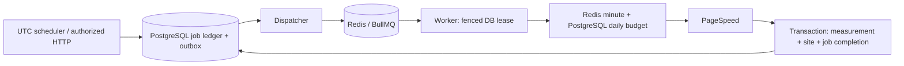

# Queue infrastructure — M2

PostgreSQL owns durable work; Redis transports it. Run web, worker and scheduler independently. The scheduler must run for outbox dispatch and retries even when work originates from the authenticated cron or manual endpoint.



## Implemented contracts

| Queue | Implemented jobs | Effect |
|---|---|---|
| performance | `site.performance.daily`, `site.performance.manual` | One real mobile PSI measurement and atomic history/site update |
| maintenance | `maintenance.cleanup` | Expired request quota rows and proofs expired more than 30 days ago |
| screenshots, emails, notifications, rankings, badges, analytics, webhooks | Reserved names | No consumer or fake success; corresponding providers/domain workflows belong to later milestones |

The `background_jobs` row is both job state and transactional outbox. Creation and its audit event share a transaction. Future domain changes must insert their event/job in the same domain transaction; M2 does not claim a payment or mail outbox implementation.

Only job UUID and correlation UUID travel through Redis. URLs, emails, provider credentials and raw upstream errors do not. Workers load the authorized target from PostgreSQL and reapply the public URL policy. Per-site transaction advisory locks serialize claims; leases carry a random token and expire after 180 seconds. Every result commit checks the current token and status under a row lock. `speed_tests.background_job_id` is unique and references the retained job.

Daily/manual keys are `site:{siteId}:{UTC day}:mobile`. Manual retesting is therefore limited to the same one queued measurement per site/day as scheduled work. The owner can use `POST /api/sites/{slug}/retest` with a same-origin authenticated session and inspect `GET /api/jobs/{id}`. Another owner receives 404. The site UI will expose this workflow in the later product redesign; the original interactive submission PSI request remains synchronous, bounded and quota protected.

The scheduler selects at most 500 overdue public/unpaused sites per tick and dispatches at most 100 records, rotating by last dispatch timestamp. Old-day queued measurements finish with `skipped: SUPERSEDED`; missing/changed/paused targets are skipped without writing invented metrics. A completed or failed daily key is not automatically recreated that day.

## Retries and recovery

PostgreSQL owns attempts and retry timing. BullMQ delivery attempts are 1 to avoid independent retry policies. Provider failures back off 60 seconds, then 120 seconds, with configurable maximum attempts (default 3). Invalid payloads/blocked URLs fail permanently. Quota exhaustion schedules the actual next quota window without consuming the failure budget. Failed rows are the durable dead-letter set.

The dispatcher checks pending, queued and expired running records. It republishes a missing Redis delivery, or removes a terminal Bull delivery before reusing its stable UUID. Active/waiting deliveries are left intact. Malformed persisted contracts fail individually so they cannot starve valid work. Producer operations fail within a bounded deadline; the saved DB row remains retryable.

After a hard worker crash, the DB lease eventually expires. A replay can reserve a new attempt. Cancellation clears the lease and fences a late response. Cancelling cannot retract an HTTP request already received by Google; a crash between provider response and database commit may require another real request. The guarantee is at most one persisted measurement per job, not exactly one external HTTP call.

Redis complete/failed deliveries have bounded retention; PostgreSQL terminal jobs and audit events remain for deduplication and inspection. Do not delete successful ledger rows to reduce queue size. Their retention/archive policy can be extended with durable idempotency tombstones in a later operational milestone.

## Budgets and configuration

All processes sharing a queue prefix must use the same `WORKER_CONCURRENCY`, `PSI_REQUESTS_PER_MINUTE` and `PSI_REQUESTS_PER_DAY`. Compose supplies these through shared environment settings. Global Bull concurrency defaults to 2 for performance and 1 for maintenance. Queue policy is restored before publish after Redis metadata loss. Roll out policy changes consistently across roles.

Every actual primary or backup PSI HTTP call reserves a shared Redis minute slot and PostgreSQL daily slot. Defaults are10/minute and1000/day; the daily cap uses database UTC time and atomic conditional upsert. Reservations are not refunded after ambiguous failures. Redis/DB unavailability denies new provider work. Redis loss can reset minute counters, but cannot reset the PostgreSQL daily budget. Ordinary per-user/request windows also use Redis and hashed actors; no forwarded IP is trusted for provider cost control.

See [.env.example](../.env.example) for exact names and defaults. Redis must use authentication, private networking, AOF `everysec`, bounded memory and `noeviction`. The readiness probe checks these policies and application DB role/migration requirements. AOF can lose roughly its last second during a crash; durable jobs are rebuilt from PostgreSQL. A noeviction memory error delays publishing rather than silently evicting work.

## Operator commands

Build with `npm run build:jobs`. Commands read exported environment; they deliberately do not load `.env.local` or accept secrets as CLI arguments. In the private jobs container:

```sh
node dist/jobs/queue-admin.cjs status
node dist/jobs/queue-admin.cjs inspect JOB_UUID
node dist/jobs/queue-admin.cjs cancel JOB_UUID
node dist/jobs/queue-admin.cjs retry JOB_UUID
node dist/jobs/queue-admin.cjs requeue JOB_UUID
```

Replace `JOB_UUID` with the actual ledger ID. `status` reports Redis waiting/active/completed/failed/delayed/paused plus DB states, delayed work, retrying and dead-letter totals. A Redis outage still permits the DB report. `inspect` returns safe identifiers/status and the latest 100 events, omitting payload, credentials and raw provider errors. `retry` and `requeue` are synonyms that grant another bounded attempt window to failed/cancelled jobs; they never reset history or completed work. Operator actions record category `operator` in the audit trail. Host/container access controls operator identity; per-person administrative RBAC/UI is a later milestone.

Structured worker logs carry correlationId, jobId, siteId, attempt, durationMs and safe errorCode. Monitor oldest pending/delayed age, expired leases, failed totals, quota exhaustion and Redis memory/AOF health. These are operational signals; automated external alert delivery still needs deployment configuration.

## Cutover and rollback

1. Back up and migrate staging through 0002 using the guarded owner-only CLI; grant the application role access to new tables.
2. Deploy authenticated persistent Redis and web/worker using the same queue policy. Confirm live/ready probes.
3. Stop the old cron/retest scheduler. Set `SCHEDULER_ENABLED=true`, enable the Compose scheduler profile, and deploy the separate scheduler. Repeated compatibility triggers are deduplicated but must not coexist with the retired implementation writing measurements independently.
4. Inspect a synthetic maintenance job, then an explicitly controlled real site with production credentials during release validation.
5. To pause generation/dispatch, stop the scheduler. Workers may drain existing deliveries; stop them as well to halt processing. Pending DB rows remain. Roll back the whole web/jobs release consistently and retain additive schema/data. Do not run old synchronous cron alongside new workers.

Workers and scheduler have 150 seconds to drain and a 160-second container grace period. SIGKILL relies on lease recovery. PostgreSQL backups remain mandatory independently of Redis AOF.

Design references: [BullMQ connections](https://docs.bullmq.io/guide/connections), [production guidance](https://docs.bullmq.io/guide/going-to-production), [idempotent jobs](https://docs.bullmq.io/patterns/idempotent-jobs), [worker shutdown](https://docs.bullmq.io/guide/workers/graceful-shutdown), [Redis persistence](https://redis.io/docs/latest/operate/oss_and_stack/management/persistence/).
