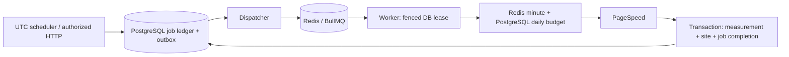

# Durable queue operation

PostgreSQL owns durable work; Redis transports it. Run web, worker and scheduler independently. The scheduler process must run for outbox dispatch and retries even when work originates from authenticated HTTP or a provider webhook. Compose starts it by default. `SCHEDULER_ENABLED=false` means **dispatch only**: it delivers existing manual/submission/provider jobs and retries but generates no recurring work. `true` additionally generates daily measurements, maintenance, period closure and badge/award checks. Demo requires false. Health/logs identify `dispatch-only` or `generation-and-dispatch`; stop the process to halt dispatch itself.

External cron is retired. `/api/cron/retest` always returns **410 Gone**, including calls with old credentials, and cannot create or dispatch jobs. Remove its external cron entry and `CRON_SECRET`. Recurring work is generated by the dedicated scheduler and executed by BullMQ workers; no Coolify scheduled task or system cron entry is needed.



## Implemented contracts

| Queue | Implemented jobs | Effect |
|---|---|---|
| performance | `site.performance.daily`, `site.performance.manual` | Two real PSI samples for the selected mobile/desktop strategy; one complete aggregate/history row |
| performance | `submission.prepare` | Owner-scoped metadata and mobile+desktop proofs; retry reuses still-valid completed strategy proofs |
| screenshots | `site.screenshot.capture` | Idempotent isolated-service capture/poll; fenced public metadata storage |
| webhooks | `payment.webhook` | Verified durable provider event processing and transactional entitlement updates |
| emails | `email.deliver` | Preference-aware Graph mail ledger; ambiguous send outcomes require review |
| analytics | `analytics.payment` | Sanitized provider payment analytics, independently feature gated |
| rankings | `ranking.finalize` | Close immediately previous UTC week/month; immutable method/device-separated snapshots |
| badges | `site.awards.evaluate`, `site.badge.verify` | Evidence-only achievements; preview before live badge status checks, no automatic removal |
| maintenance | `maintenance.cleanup` | Old request counters/proofs; end-date expiry of active ad reservations, never uncertain held/paid ones |
| notifications | Reserved queue name | In-app notifications already commit with domain changes; email delivery uses the emails queue |

The `background_jobs` row is both job state and transactional outbox. Creation and its audit event share a transaction. Payment events, email delivery, approved submission measurements, screenshot requests and award follow-up jobs use the same durable boundary. Feature-disabled external integrations never fake a provider success.

Only job UUID and correlation UUID travel through Redis. URLs, emails, provider credentials and raw upstream errors do not. Workers load the authorized target from PostgreSQL and reapply the public URL policy. Per-site transaction advisory locks serialize claims; leases carry a random token and expire after 180 seconds. Every result commit checks the current token and status under a row lock. `speed_tests.background_job_id` is unique and references the retained job.

Daily/manual keys are `site:{siteId}:{UTC day}:{mobile|desktop}`. Manual retesting shares the same one queued batch per site/day/strategy as scheduled work. The owner can use `POST /api/sites/{slug}/retest` with a same-origin authenticated session and inspect `GET /api/jobs/{id}`. Another owner receives 404. Submission preparation has an owner-only receipt and stores server proofs before transactional consumption creates the listing; client scores never become measurements. The compatibility interactive PSI endpoint remains bounded and quota protected.

When generation is enabled, each tick selects at most 500 missing site/strategy daily keys and up to 100 sites for award/badge jobs; outbox dispatch takes at most 100 records, taking turns across queues and rotating each queue by last dispatch timestamp. This keeps payment events, email and maintenance moving during large measurement backlogs. Expired running deliveries rotate too while preserving the existing lease token and retry state. Old-day queued measurements finish with `skipped: SUPERSEDED`; missing/changed/paused targets are skipped without invented metrics. A completed or failed daily key is not automatically recreated that day. A mobile sample does not suppress desktop work. Screenshot/submission polls preserve their receipts and return to pending without charging an attempt merely for waiting.

## Retries and recovery

PostgreSQL owns attempts and retry timing. BullMQ delivery attempts are 1 to avoid independent retry policies. Provider failures back off 60 seconds, then 120 seconds, with configurable maximum attempts (default 3); bounded provider `Retry-After` can extend the delay up to 24 hours. Invalid payloads, blocked URLs and missing/forbidden targets fail permanently. Quota exhaustion schedules the actual next quota window without consuming the failure budget. Failed rows are the durable dead-letter set. Graph `uncertain` deliveries never auto-resend because a 202 or lost response cannot prove delivery/idempotency.

The dispatcher checks pending, queued and expired running records. It republishes a missing Redis delivery, or removes a terminal Bull delivery before reusing its stable UUID. Active/waiting deliveries are left intact. Malformed persisted contracts fail individually so they cannot starve valid work. Producer operations fail within a bounded deadline; the saved DB row remains retryable.

After a hard worker crash, the DB lease eventually expires. A replay can reserve a new attempt. Cancellation clears the lease and fences a late response. Cancelling cannot retract an HTTP request already received by Google; a crash between provider response and database commit may require another real request. The guarantee is at most one persisted measurement per job, not exactly one external HTTP call.

Redis complete/failed deliveries have bounded retention; PostgreSQL terminal jobs and audit events remain for deduplication and inspection. Do not delete successful ledger rows to reduce queue size. Their retention/archive policy can be extended with durable idempotency tombstones in a later operational milestone.

## Budgets and configuration

All processes sharing a queue prefix must use the same `WORKER_CONCURRENCY`, `PSI_REQUESTS_PER_MINUTE` and `PSI_REQUESTS_PER_DAY`. Compose supplies these through shared environment settings. Global Bull concurrency defaults to 2 for performance and 1 for each other implemented queue. Queue policy is restored before publish after Redis metadata loss. Roll out policy changes consistently across roles.

Every actual primary or backup PSI HTTP call reserves a shared Redis minute slot and PostgreSQL daily slot. Defaults are10/minute and1000/day; the daily cap uses database UTC time and atomic conditional upsert. Reservations are not refunded after ambiguous failures. Redis/DB unavailability denies new provider work. Redis loss can reset minute counters, but cannot reset the PostgreSQL daily budget. Ordinary per-user/request windows also use Redis and hashed actors; no forwarded IP is trusted for provider cost control.

See [.env.example](../.env.example) for exact names and defaults. Redis must use authentication, private networking, AOF `everysec`, bounded memory and `noeviction`. The readiness probe checks these policies and application DB role/migration requirements. AOF can lose roughly its last second during a crash; durable jobs are rebuilt from PostgreSQL. A noeviction memory error delays publishing rather than silently evicting work.

## Operator commands

Build with `npm run build:jobs`. Commands read exported environment; they deliberately do not load `.env.local` or accept secrets as CLI arguments. In the private jobs container:

```sh
node dist/jobs/queue-admin.cjs status
node dist/jobs/queue-admin.cjs inspect JOB_UUID
node dist/jobs/queue-admin.cjs cancel JOB_UUID
node dist/jobs/queue-admin.cjs retry JOB_UUID
node dist/jobs/queue-admin.cjs requeue JOB_UUID
node dist/jobs/queue-admin.cjs screenshots-preview
node dist/jobs/queue-admin.cjs screenshots-backfill 25
```

`screenshots-preview` only counts public active/verified listings missing an initial image. `screenshots-backfill` accepts an explicit batch size from 1 to 25 and creates ordinary durable capture jobs, spaced ten seconds apart across batches. Repeat preview and bounded batches to cover a larger import. Private/archived listings, current images, in-flight requests and any previously attempted initial key are excluded. Failed initial jobs use the normal inspected `retry` path. Invalid historical URLs remain unchanged and are reported as an aggregate; correct these before repeating the batch. The command never reuses or publishes a private submission preview. Check the central client's remaining daily quota first; the current default is 250 captures/day. Ten-second spacing limits enqueue throughput to six/minute, preserving room under the default ten/minute client limit.

Public submission and administrative publication create an initial capture in the listing transaction. `history=daily` controls cache identity and retention (30 days by default), not a daily capture schedule. With both `SCHEDULER_ENABLED` and `SCREENSHOTS_ENABLED`, recurring ticks renew established desktop previews only when none for the current normalized URL lasts more than another 24 hours. A real source URL change therefore refreshes the preview; tracking parameters and an omitted root slash do not. Each tick inspects at most 100 candidates in rotating order and materializes at most 25, uses the same ten-second batch spacing and skips in-flight work. A site/day refresh key prevents repeated attempts after terminal failure that day. Sites with no initial capture require the explicit backfill above; fresh previews incur no recurring capture. This keeps the public preview available without recapturing the entire directory every day. The scheduler receives only the feature flag; capture credentials remain on the web/worker roles.

Replace `JOB_UUID` with the actual ledger ID. `status` reports Redis waiting/active/completed/failed/delayed/paused plus DB states, delayed work, retrying and dead-letter totals. It also reports due counts and oldest due timestamps, expired leases, last successful work, current UTC-day mobile/desktop measurement coverage for eligible sites, daily provider usage and email delivery totals grouped by status and safe error code. Only complete measurements using the current methodology count toward coverage. The `policy` object reports the shared provider budget. Verify the scheduler's `/health/ready` mode separately to confirm recurring generation is enabled; a worker container does not know the scheduler's flag. A Redis outage still permits the DB report. `inspect` returns safe identifiers/status and the latest 100 events, omitting payload, credentials and raw provider errors. `retry` and `requeue` are synonyms granting another bounded attempt window to failed/cancelled jobs; they never reset history or completed work. Host/container access controls CLI identity. Authenticated administrative actions additionally require explicitly bootstrapped database roles and safe audit records; signup never grants admin access.

## Domain notifications

The fenced measurement transaction compares the newest complete result with the previous compatible strategy/method lab batch. An absolute change of at least ten score points emits `performance_improved` or `performance_dropped`; no prior compatible evidence means no comparison. Current legacy/mobile display values are never a desktop baseline. User performance preferences suppress these events.

Weekly closure emits `weekly_result` for each recorded overall entrant and `weekly_winner` for the actual #1, separately per device. Weekly/monthly `ranking_changed` requires a different actual rank in the immediately previous compatible closed period; absent prior ranks are not invented. Weekly preferences apply. Period closure and these notifications share a transaction; repeated/concurrent closure does not duplicate them. Award and badge-warning triggers are described in [AWARDS-AND-BADGES.md](AWARDS-AND-BADGES.md). Disabled email retains permitted in-app events but creates no future email backlog.

Structured worker logs carry correlationId, jobId, siteId, attempt, durationMs and safe errorCode. Monitor oldest pending/delayed age, expired leases, failed totals, quota exhaustion and Redis memory/AOF health. These are operational signals; automated external alert delivery still needs deployment configuration.

Each successful dispatcher tick logs `scheduler.tick_completed` with duration, generation mode, scheduled/dispatched counts and scheduling failure count. A delivery count includes reconciliation of an existing Redis job, so it is not a count of completed measurements. For daily checks, confirm worker/scheduler readiness, inspect this heartbeat and compare both device coverage counts against eligible sites using `queue-admin status`. Email `uncertain` and failed deliveries require the documented provider review before an operator retries them.

## Cutover and rollback

1. Back up and run all current guarded migrations using the owner-only maintenance CLI; grant the application role access to new tables.
2. Deploy authenticated persistent Redis and web/worker using the same queue policy. Confirm live/ready probes.
3. Keep the separate scheduler running with `SCHEDULER_ENABLED=false` to validate manual dispatch first. Remove the old cron/retest schedule before setting true in production; the HTTP endpoint returns 410. Confirm scheduler readiness reports `generation-and-dispatch`, then check daily job creation and actual worker completions. Demo remains false.
4. Inspect a synthetic maintenance job, then an explicitly controlled real site with production credentials during release validation.
5. To pause generation/dispatch, stop the scheduler. Workers may drain existing deliveries; stop them as well to halt processing. Pending DB rows remain. Roll back the whole web/jobs release consistently and retain additive schema/data. Do not run old synchronous cron alongside new workers.

Workers and scheduler have 150 seconds to drain and a 160-second container grace period. SIGKILL relies on lease recovery. PostgreSQL backups remain mandatory independently of Redis AOF.

Design references: [BullMQ connections](https://docs.bullmq.io/guide/connections), [production guidance](https://docs.bullmq.io/guide/going-to-production), [idempotent jobs](https://docs.bullmq.io/patterns/idempotent-jobs), [worker shutdown](https://docs.bullmq.io/guide/workers/graceful-shutdown), [Redis persistence](https://redis.io/docs/latest/operate/oss_and_stack/management/persistence/).
